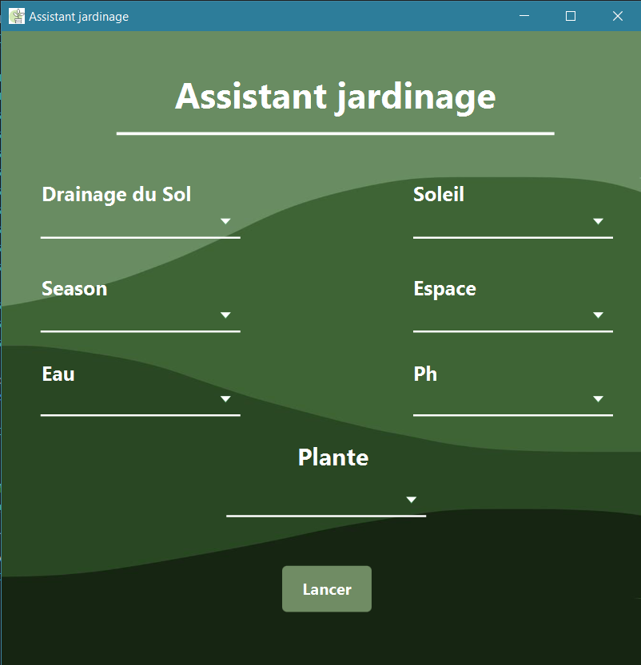
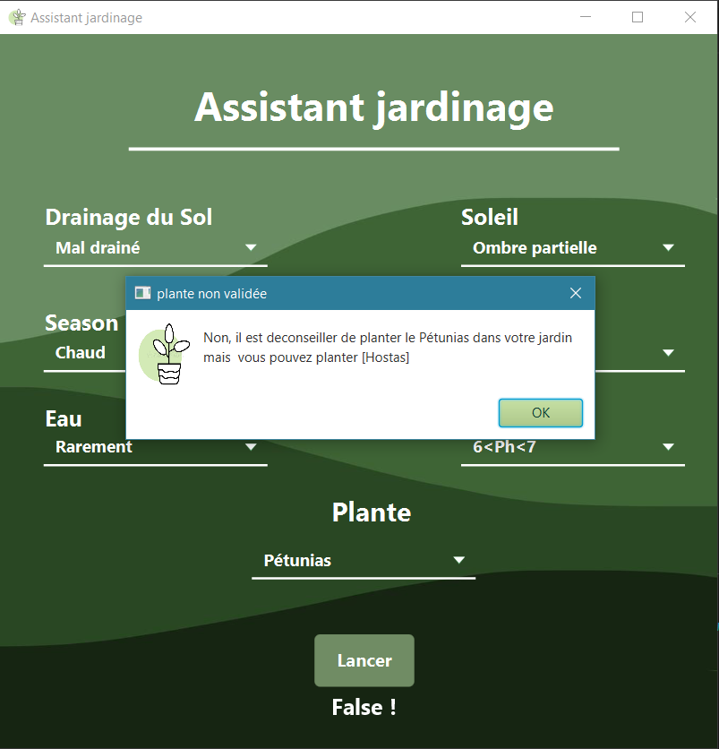

# Assistant de jardinage 🌱 

Il s'agit d'un système expert qui simule l'expertise humaine en matière de végétation. L'utilisateur fournit des informations sur le climat, le type de sol et la plante souhaitée.

 En fonction de ces données et des besoins de la plante, le système approuve ou non la plantation grâce à sa base de connaissances et son moteur d'inférence.


## Prérequis et Installation 🛠️

  Prérequis:

- javaFX

D'abord se deplacer au bon niveau

```bash
  cd  src\main\java\GUI
```

Ensuite compiler et executer le fichier 

```bash
  javac GUI.java
  java GUI.java
```

## Exemples 🌾

L'image ci-dessous montre l'interface qu'utilise l'utilisateur pour interagir avec le système expert, il pourra choisir pour chaque caractéristique ce qui correspond à son jardin ainsi que la plante qu’il souhaite voir s'il devrait la planter ou pas.

<p align="center">
  
</p>


Dans l'exemple suivant, le système expert ne recommande pas la plante choisis mais affichera une liste de plantes alternatives préférée pour le jardin en question

<p align="center">
  
</p>


## License 📜

[MIT](https://choosealicense.com/licenses/mit/)

